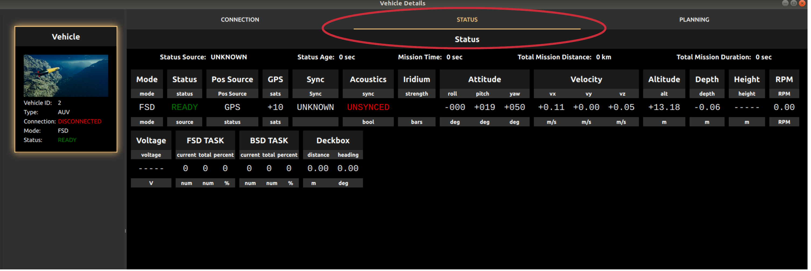
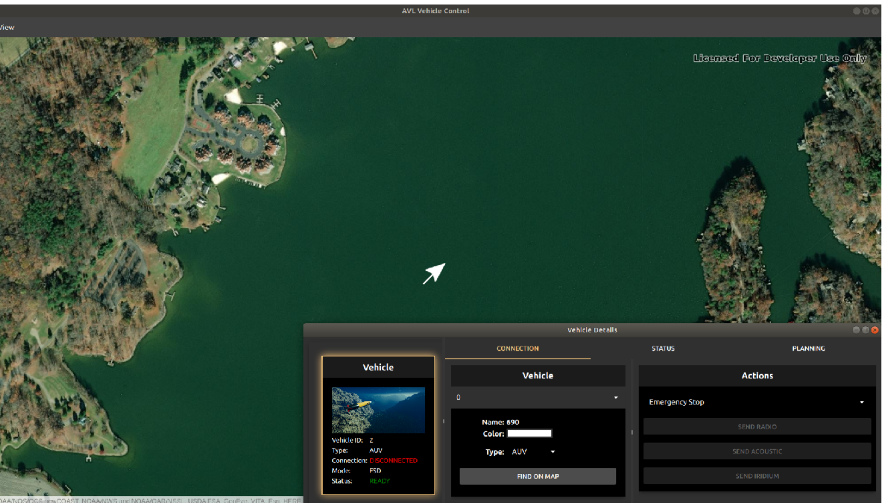

.. Copyright (c) 2020, Center for Marine Autonomy and Robotics

   Distributed under the terms of the BSD 3-Clause License.

   The full license is in the file LICENSE, distributed with this software.

.. image:: images/vt_marine_autonomy_logo.png

Getting Started
===============

Mission Control can be used with or without a vehicle running on the same network. To enable most of the functionalities 
a vehicle should be running or simulated on the same network as the mission control application.

.. _RST_Getting_Started_Connecting:

Connecting to a Vehicle
-----------------------
After building and running the mission control you can see two windows on your screen:

.. image:: images/initial_windows.png

If no vehicle is running on the network you will not be able to see any vehciles on the map and vehicle detail windows.
The mission control can still be used to plan missions.

If any vehicle is running on the same network, it will automatically show up on the map and vehicle detail windows. As 
shown below:

.. image:: images/vehicle_on_network.png

To connect to the vehicle you can either select the vehicle from the drop down menu in Vehicle or select the vehicle from
the sidebar as shown in the images below:

.. image:: images/connecting_to_vehicle.png

.. _RST_Vehicle_Status:

Vehicle Status
--------------
To confirm that the vehicle is connected and sending its status back, you can navigate to the Status tab to monitor vehicles
current status as shown in the image below:

Once the vehicle is connected you can also see the current position of the vehicle on the map window.

If the status is not updating there is some connection problems or the vehicle is under water.

.. _RST_Planning_a_Mission:

Planning a Mission
------------------
