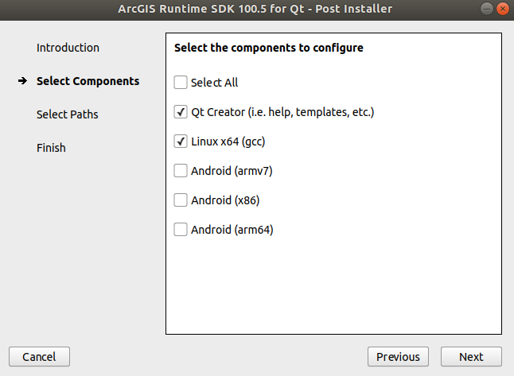
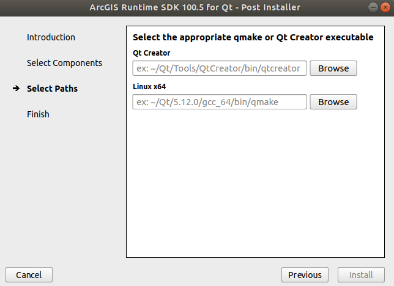

.. Copyright (c) 2020, Center for Marine Autonomy and Robotics

   Distributed under the terms of the BSD 3-Clause License.

   The full license is in the file LICENSE, distributed with this software.

.. image:: images/vt_marine_autonomy_logo.png

Installation
============
Mission Control can be built from source as well as installed as a dynamically
and statically linked binary. The :ref:`RST_Installation_Development` Subsection describes
how the application can be installed for development purposes.

We also provide a pre-built application image which does not require any installation. These
can be downloaded here. <TODO INSERT LINK>

.. _RST_Installation_Development:

For Development
---------------

Step:1 : Download and Install Qt
********************************
Please download any version of Qt >= 5.15 from here: `Qt Download Page`_. Also install the
latest version of Qt Creator which will be bundled with the Qt installer.
If you are using the online installer Qt will download a **.run** file on your system. To run open
a terminal in the download file location and run:

.. code::

    chmod a+x qt_installer.run
    ./qt_installer.run

Step:2 : Download and Setup ArcGIS
**********************************
To compile and effectively use the Mission Control we also need to setup ArcGIS.
Download `ArcGIS 100.8 <https://developers.arcgis.com/qt/latest/>`_. You might need a 
developer account to download the setup. Please create one `here <https://developers.arcgis.com/sign-in/>`_.

Once logged in, download ArcGIS 100.8 for your specific OS.

Alternatively, the Linux ArcGIS 100.8 installation file can also be accessed on `G-Drive <https://drive.google.com/file/d/1Q6pcjDDqZF8C8vNNpYaUyXXHClRzemuD/view?usp=sharing>`_.

Extract the tar.gz using the following command:

.. code::

    tar -xf ArcGIS_Runtime_SDK_Qt_Linux64_100_8_0.tar.gz

from the extracted directory run:

.. code::

    ./Setup

Follow the instructions to install ArcGIS.
For the post installer select the following:

Enter the location of Qt Creator and qmake binaries from your system.
**Note:** Qt Creator is generally located in */home/user/Qt/Tools/QtCreator/bin/qtcreator*.

Step:3 : Download Mission Control
*********************************
You can clone the Mission Control Application using:

.. code::

    git clone https://ascl3.ece.vt.edu/avl/user-interface/avl_mission_control

Setup:4 : Setup Mission Control using Qt
****************************************
Open the QtCreator, From File, select Open a project, navigate to the cloned mission control 
folder and select the avl_mission_control.pro file. Configure the file with desktop setting in Qt.

Build (Ctrl + B) and 
Run (Ctrl + R)

.. _Qt Download Page: https://www.qt.io/download-open-source