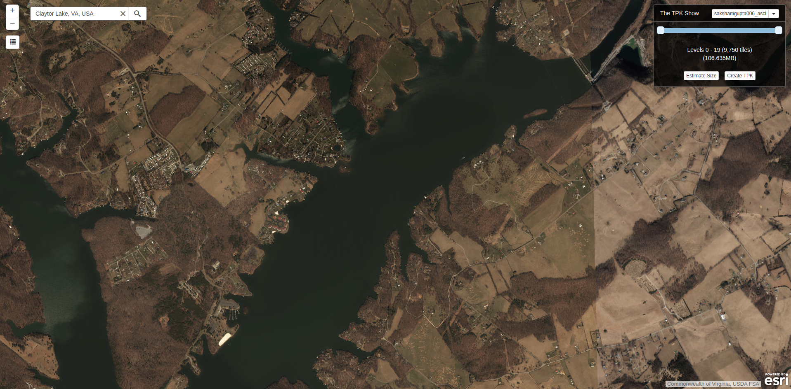
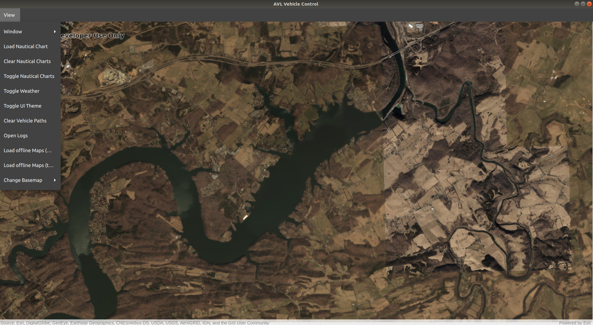

.. Copyright (c) 2020, Center for Marine Autonomy and Robotics

   Distributed under the terms of the BSD 3-Clause License.

   The full license is in the file LICENSE, distributed with this software.

.. image:: images/vt_marine_autonomy_logo.png

Offline Maps
============

The Mission Control sofware is capable of loading offline maps of types **.tpk** and 
**.mmpk**. This feature is highly desirable when operating in limited internet connectivity regions.
The operators can download the maps before the mission and load time at the time of the mission.

Generating an Offline Map(.tpk)
-------------------------------
To generate an offline map of a region navigate to `The TPK Show Website <https://nixta.github.io/tpk-creator/#>`_.
Then sign-in with your ArcGIS credentials. Now you can search for a place in the search bar provided or can drag the
map to the appropriate location.

Here you can Create a TPK file by specifying the level of detail you want in the map. More levels means that the map
will have better resolution as you try to zoom in from the current view. The current view of the map is the view you
will start with when you load the map in the Mission Control Software.

Once you have finalized all of the parameters click **Create TPK**, to download the tpk file.

Loading the Offline Map(.tpk)
-----------------------------
The generated .tpk file can now be loaded in the Mission Control Software. To load the press View in the Map window 
and select Load offline Maps (tpk) option, next select the downloaded tpk file. Now you have the offline map in the 
map window which will provide all the functionalities of the previous map.

